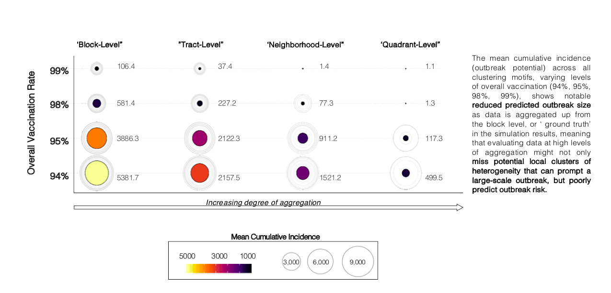
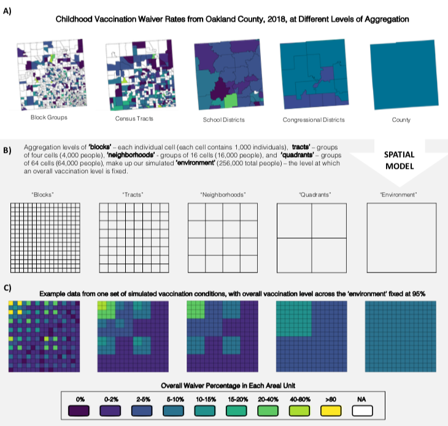
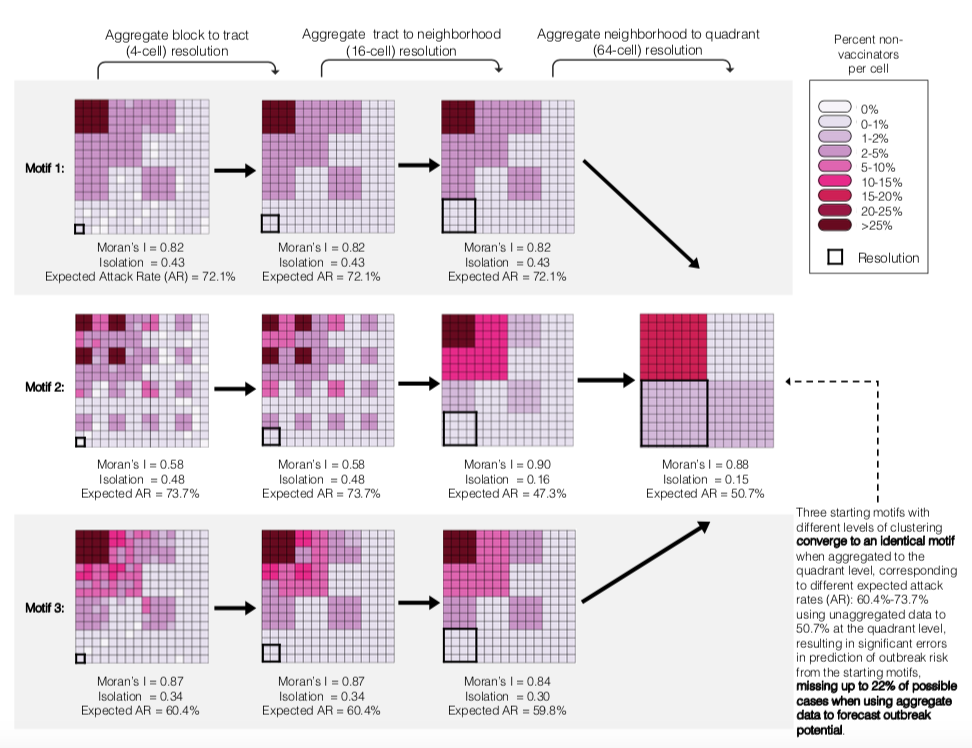
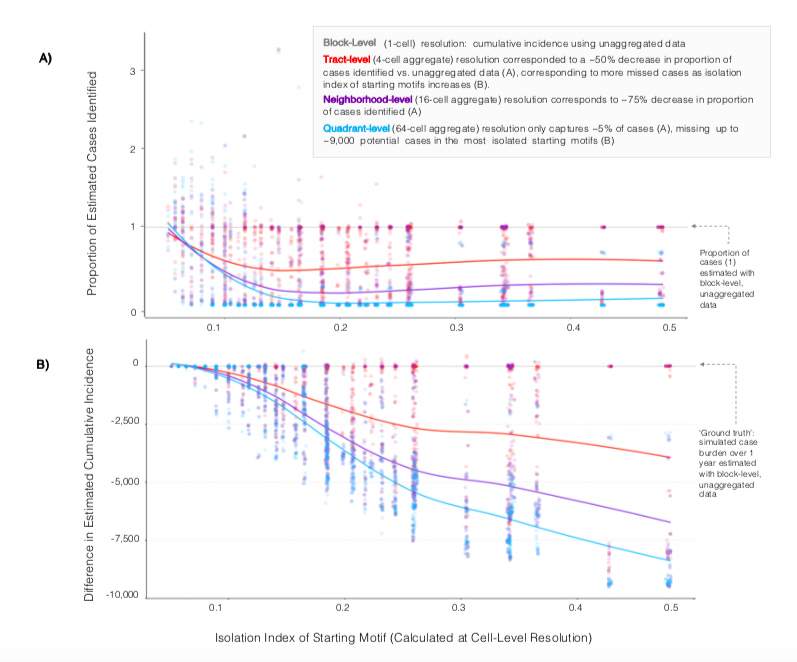

## The Backstory: Rising Cases of Measles Despite High Vaccination Coverage

This explainer is about my recent paper published in PNAS.

Even though US measles **vaccination rates** were on average **higher than 95%**, which is the WHO vaccination coverage target and threshold for **maintaining herd immunity** for measles, there were 1,282 cases of measles in 31 states in 2019.

High coverage with **measles-containing-vaccine (MCV)** is necessary because of how contagious measles is – [it has a basic reproduction number (R0) of 12-18: among the highest known values for any infectious disease](https://www.who.int/immunization/newsroom/multimedia/Chapter_1.pdf?ua=1#:~:text=The%20basic%20reproduction%20number%2C%20Ro,infectious%20communicable%20disease%20%5B18%5D.). The R0 refers to how many secondary cases an initial case will create in a totally susceptible population, i.e. how many people one case will infect. Because of how infectious measles is, the proportion of the population that needs to be vaccinated or have natural immunity from prior disease to prevent outbreaks, known as the [**critical vaccination fraction (Vc)**, is around **94-95%**](https://www.ncbi.nlm.nih.gov/pmc/articles/PMC2988255/#:~:text=Hence%2C%20early%20estimates%20suggest%20that,of%20life%20(WHO%202003).).

The Vc can be expressed in terms of the Ro and vaccine efficacy (VE):

$$V_{c} = \frac{1-\frac{1}{R_{0}}}{V_{E}}$$ 

*The equation for the critical vaccination fraction[ Vc, can be expressed in terms of the Ro and vaccine efficacy (VE)](https://www.sciencedirect.com/science/article/abs/pii/S0025556402001293#:~:text=The%20critical%20vaccination%20fractions%20are,starting%20point%20for%20disease%20elimination.)*

This formula makes a key assumption: that the population is evenly mixed – all individuals contact each other with equal likelihood. However, when non-vaccinated individuals are geographically clustered (grouped in certain areas), the formula **can underestimate the Vc, meaning that outbreaks remain possible despite vaccination coverage targets being met or exceeded at the state or national level**, as we saw in 2019.

### What did we want to show?
1.	A simple, easy-to-visualize model that shows what happens as non-vaccinators become spatially clustered though overall vaccination coverage is high enough to maintain herd immunity.
2.	Illustrate the consequences of aggregating data from small to large levels of geographic scale/grouping to show how aggregation may miss fine-scale clustering, biasing predicted outbreak size.

Answering these questions has the potential to help successfully implement control strategies for *both* emergent measles outbreaks and COVID-19.

### What did we do?
We created a simple grid with 256 cells of 1,000 people each. Our model had 4 nested levels which matched what we see in real vaccination data: “blocks” of 1,000 people (individual cells, made to approximate the size of a census block group, which is about 1,000 people), “tracts” of 4,000 people (4 cells, again made to approximate census tracts of ~4,000 people), “neighborhoods” of 16,000 people (16 cells), and “quadrants” of 64,000 people (64 cells). Here, quadrants could represent a small city or township. The figure below represents these spatial levels.

Within this environment, we created clustering motifs (patterns of clustering) to represent environments that have different patterns of clustering. We kept the overall number of non-vaccinators fixed and only toggled the degree of clustering to see how that impacted outbreak probability and size.

We modeled measles using a dynamic transmission model on this grid, a standard modeling technique for infectious diseases like measles, where individuals can pass through 3 states: susceptible (i.e. not yet infected), infectious, and recovered (or vaccinated, in this case). Read more here.

### What did we find?
1. **<i>More clustering</i> of unvaccinated individuals leads to *higher outbreak probability* and <i>larger outbreak size.</i>**

*Without clustering,* overall vaccination coverage of 94% and higher *upheld herd immunity* (i.e. there were no outbreaks). However, once we introduced clustering, even 99% overall vaccination allowed breakthrough outbreaks. <i><u>As clustering increased, outbreaks were more likely to happen, and were larger.</u></i>

2. **If we *aggregate the fine-scale clustering motifs to larger units* (like using using county, state, or national-level estimates), this severely *underestimates* the expected outbreak probability and size.**

At 95% overall vaccination, the expected outbreak size was predicted to be 3,886 cases using unaggregated data, which was reduced by 45.4% when aggregated to the tract level, by 76.5% at the neighborhood level, and by 99.9% at the quadrant level – predicting no cases at all.  

The following diagram shows how this aggregation process obscures fine-scale spatial heterogeneity. <i><u>This shows how working from state-level data can mask different possible patterns of clustering that have different consequences for infectious disease transmission. Without access to that finer-scale data, it’s impossible to know how best to protect communities. </u></i>

<i>These motifs have 3 different underlying patterns of non-vaccination and outbreak potential, but when they are aggregated to the quadrant level, they are identical.</i>

3. **The *more clustered the initial environment* – the *more biased the aggregated estimate* will be.**

Aggregating vaccination data consistently underestimated outbreak potential, but that the bias (i.e., how *much* that outbreak potential was underestimated) increased based on how clustered the original motif was.

<i>Panel A shows the proportion of cases that are estimated at each level of aggregation, indicating that about 50% of cases are missed when aggregated to the tract level (red), 75% when aggregated to the neighborhood level (purple), and almost entirely at the quadrant level (blue). Panel B shows that more cases are missed as the isolation index (the x-axis), a measure of clustering, increases.</i>

### What does this mean for how we conduct surveillance and use vaccination data?

Our results show that failing to account for fine-scale spatial clustering in the distribution of non-vaccinators can result in overly optimistic estimates of outbreak potential. **This calls out how potentially dangerous the assumptions of homogeneous mixing which underlie herd immunity calculations can be.** Even at 99% overall vaccination coverage, clustering allowed outbreaks to occur. This means that we really must rethink whether or not herd immunity is meaningful when applied at large spatial scales like at the state or country levels.

Aggregating data strongly biases predicted outbreak size because it *obscures this fine-scale clustering.* This has important consequences for vaccine-coverage data in the US, highlighting that finer-scale data are needed to fully understand the risk of outbreaks of measles and other vaccine-preventable diseases. Vaccination data is collected at the school-level for school entry requirements, but publicly released data instead are presented at much higher levels – usually at the county or state level. This represents a significant lost opportunity for improving surveillance, because if that finer scale data were readily available, we would be able to assess community risk much more clearly. 

### Strengths and Limitations
As with all studies, our research has both strengths and limitations. A major strength is that this simple model helps to explain how clustering impacts outbreak potential. While the simplicity is a strength in communicating the value of this research, it also carries limitations; this model does not represent what true cities and social networks look like. We also used a model without an incubation period, which wouldn’t change the total number of cases but doesn’t perfectly represent how measles is transmitted.

### The Takeaways
1. The assumptions underlying the critical vaccination fraction (specifically that vaccination coverage is homogeneous) result in significant underestimation of the true number of individuals who need to be vaccinated to prevent outbreaks.
2.	Fine-scale clustering produced scenarios with the greatest outbreak potential.
3.	Since fine-scale vaccination data is not broadly available in the US, it’s difficult to allocate resources, plan vaccination strategies, and respond to imported measles cases in a way that is responsive this type of localized clustering.
4.	This research motivates the collection of finer-scale vaccination data to create ‘susceptibility maps’ that can guide policy-makers and health practitioners to preferentially direct resources to those areas at highest risk of outbreaks.